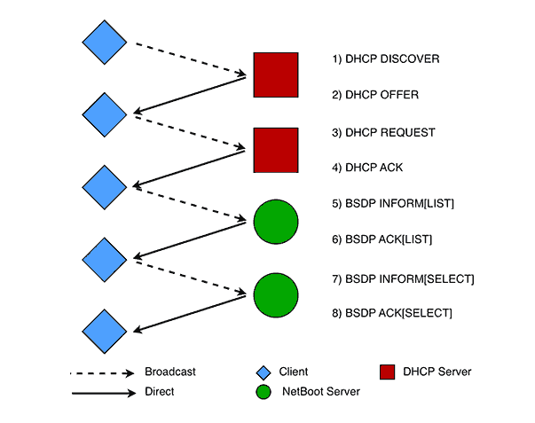

---
@title[Intro]

@snap[north headline]
### MacOS disk imaging in the data centers
@snapend

@snap[south-west]
Jake Watkins :dividehex
@snapend

@snap[south-east]
jwatkins@mozilla.com
@snapend

---
@title[What is BSDP?]

@snap[north headline]
### What is BSDP?
@snapend

@snap[west bullets]
@ul
 - BSDP = Boot Service Discovery Protocol
 - aka Netboot aka Netinstall
 - It is an extention to DHCP developed by Apple (ages ago)
 - Allows apple computers to boot over the network similar to PXE booting
 - Utilizes DHCP option 43 "vendor-specific information"
 - And option 60 "vendor class identifier
@ulend
@snapend

---
@title[BSDP exchange]
### BSDP exchange

---
@title[What is DeployStudio]
@snap[north headline]
### DeployStudio
@snapend

@snap[west bullets]
@ul
- Server application for image deployment and configuration of MacOS
- Primarily used to push disk images to Mac Minis
- Workflows are highly customizable
- Can also be used to do standalone firmware upgrades
@ulend
@snapend

@snap[south refline]
[http://www.deploystudio.com](http://www.deploystudio.com)
@snapend

+++
@title[DeployStudio kinda sucks]
@snap[north headline]
### DeployStudio kinda sucks
@snapend

@snap[west bullets]
@ul
- Documentation = NULL
- Freeware; not opensource
- MacOS version support is always behind
- I've had to debug and hack it on more than one occasion
- There are alternatives but for now it does work
@ulend
@snapend

+++?image=assets/img/ds_screenshot.png
@title[Deploystudio Screenshot]

---
@title[Apple Server App]
@snap[north headline]
### Apple Server App
@snapend

@snap[west bullets]
@ul
- Official Apple application for providing all sorts of server functions to MacOS
- eg. httpd, mail, etc...
- Important to us, it provides BSDP service
- Downloadable from the App Store...
- ... for $19.99
- there are alternatives for providing BSDP service
@ulend
@snapend

+++
@title[Apple Server App]
@snap[north headline]
### Apple Server App kinda sucks too
@snapend
@snap[west bullets]
@ul
- Apple only supports the app on the current MacOS version
- Total blackbox; hacking required to enable logging and difficult to debug
- It requires MacOS which requires hardware
- Sometimes it crashes
- It's an official Apple app so it must have good reviews on the app store, right?!?
@ulend
@snapend

@snap[south refline]
[https://itunes.apple.com/us/app/os-x-server/id883878097](https://itunes.apple.com/us/app/os-x-server/id883878097)
@snapend

+++?image=assets/img/apple_server_app_store.png
+++?image=assets/img/apple_server_app_store.png
# @color[#ff0000](GOOD JOB, APPLE!)

---
@title[What is BSDPy?]
@snap[north headline]
### What is BSDP@color[#ff0000](y)?
@snapend

@snapend
@snap[west bullets]
@ul
- Opensource, python implementation of the BSDP service
- Can run on linux and is Dockerized
- Can be HA via ZLB or consul
- Better logging
- Better contol of NBI choice logic
@ulend
@snapend

@snap[south refline]
[https://github.com/mozilla-platform-ops/relops-bsdpy](https://github.com/mozilla-platform-ops/relops-bsdpy)
@snapend

---
@title[How it all ties together]
@snap[center headline]
### How it all ties together
@snapend

+++?image=assets/img/mermaid-diagram-20181128124342.png&size=contain&position=center&color=#ffffff
@title[Sequence Diagram]

---
@title[Recorded Demo]
Demo
 

---
@title[Final]

@snap[north]
### Thank you
#### References
@snapend

@snap[west list-content-verbose span-100]
@size[.5em]( - [https://en.wikipedia.org/wiki/Boot_Service_Discovery_Protocol](https://en.wikipedia.org/wiki/Boot_Service_Discovery_Protocol)) 
- [https://static.afp548.com/mactips/bootpd.html](https://static.afp548.com/mactips/bootpd.html) 
- [https://github.com/mozilla-platform-ops/relops-bsdpy](https://github.com/mozilla-platform-ops/relops-bsdpy) 
- [https://github.com/mozilla-platform-ops/pydhcplib](https://github.com/mozilla-platform-ops/pydhcplib) 
- [https://github.com/bruienne/bsdpy](https://github.com/bruienne/bsdpy) 
- [http://www.deploystudio.com](http://www.deploystudio.com) 
- [https://itunes.apple.com/us/app/os-x-server/id883878097](https://itunes.apple.com/us/app/os-x-server/id883878097) 
@snapend

@snap[south-west]
Jake Watkins :dividehex
@snapend

@snap[south-east]
jwatkins@mozilla.com
@snapend

